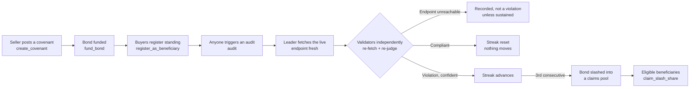

# Sentinel

**Live SLA truth-bonds for the agent economy.**

A seller posts a GEN bond behind their own advertised spec — uptime, latency, correctness,
whatever they claim about a live endpoint. Anyone can permissionlessly trigger an audit: GenLayer
independently fetches the real endpoint and judges it against that spec under the Equivalence
Principle, never trusting the seller's own dashboard. A single bad audit changes nothing — only a
sustained streak of confirmed violations slashes the bond into a claims pool for the buyers who
were already relying on it.

Not a payment gate. Not a status-page widget. Infrastructure for ongoing, capital-backed,
independently-verified service reliability — built for a world where AI agents increasingly buy
services from other agents with no human in the loop to catch a quiet degradation.

- **Network:** GenLayer Bradbury testnet
- **Contracts:** [`contracts/SentinelFactory.py`](contracts/SentinelFactory.py), [`contracts/Sentinel.py`](contracts/Sentinel.py)

## The trust problem

x402 and similar protocols solve *getting paid* for an agent-to-agent service. Nothing solves
*staying honest after payment clears*. A seller advertising "99.9% uptime" or "sub-200ms
responses" today can silently degrade and no buyer finds out except by getting burned
individually — there's no shared, trustless record of who's actually reliable, and no
consequence for quietly failing to keep a claim.

## The solution



The seller's bond is never permanently locked either: `request_exit()` starts a fixed 72h
cooldown, after which `withdraw_remaining_bond()` recovers whatever wasn't slashed — and audits
(and slashing) stay live for the whole cooldown, so a seller can't dodge an imminent breach by
exiting the instant a bad streak starts.

No breach happens on one model's say-so — it happens only once independent validators, each
fetching the live endpoint themselves, agree the seller genuinely failed its own spec.

## Why this needs GenLayer

Judging "does this live response actually satisfy this advertised spec" is a reasoning task, not
a deterministic check — it requires reading unstructured, freshly fetched content against a
natural-language claim. A single off-chain monitor making that call just relocates the trust
problem to whoever runs it. GenLayer's Equivalence Principle is what makes the judgment
cryptoeconomically trustworthy: a violation only counts once a majority of independent
validators, each doing their own fetch and their own reasoning, reach the same conclusion.

## How to use it

**1. Post a covenant** (any address may call this):

```
SentinelFactory.create_covenant(service_name, endpoint_url, spec, slash_amount, min_bond) -> address
```

**2. Fund the bond** (permissionless top-up; auto-activates once it clears `min_bond`):

```
Sentinel.fund_bond()  # payable
```

**3. Register as a relying party** (permissionless, free, timestamped):

```
Sentinel.register_as_beneficiary()
```

**4. Trigger an audit** (any address may call this — no special "auditor" role, rate-limited to
once per 5 minutes):

```
Sentinel.audit() -> audit_id
```

**5. Claim a breach share** (beneficiaries who registered before the triggering audit, pull-based):

```
Sentinel.claim_slash_share(breach_id)
```

**6. Read the live status** (no gas, anyone, including other contracts):

```
Sentinel.get_covenant_info() -> { status, bond, consecutive_failures, total_breaches, ... }
```

Full details in [`docs/AGENT_SDK.md`](docs/AGENT_SDK.md).

## Repository structure

```
sentinel/
├── contracts/          SentinelFactory.py, Sentinel.py
├── tests/
│   ├── direct/          41 passing tests against gltest's WASI mock
│   └── integration/     Tests against a real GenLayer node (factory deploy flow)
├── frontend/            Next.js 15 App Router application
├── deploy/              Deployment scripts
├── docs/                ARCHITECTURE.md, RESOLUTION_LOGIC.md, AGENT_SDK.md, AUDIT.md
├── gltest.config.yaml
├── package.json
└── pyproject.toml
```

## Local development

```bash
# Contracts
pip install .
genvm-lint check contracts/Sentinel.py
genvm-lint check contracts/SentinelFactory.py
gltest tests/direct -v

# Frontend
npm install
npm run dev --workspace=frontend
```

See [`docs/ARCHITECTURE.md`](docs/ARCHITECTURE.md) for the full system design, storage
constraints, and rationale behind every deliberate design choice, [`docs/RESOLUTION_LOGIC.md`](docs/RESOLUTION_LOGIC.md)
for a line-by-line walkthrough of `audit()` and the breach state machine, and
[`docs/AUDIT.md`](docs/AUDIT.md) for a self-adversarial review pass calibrated against real
GenLayer reviewer rejection language.

## License

MIT
