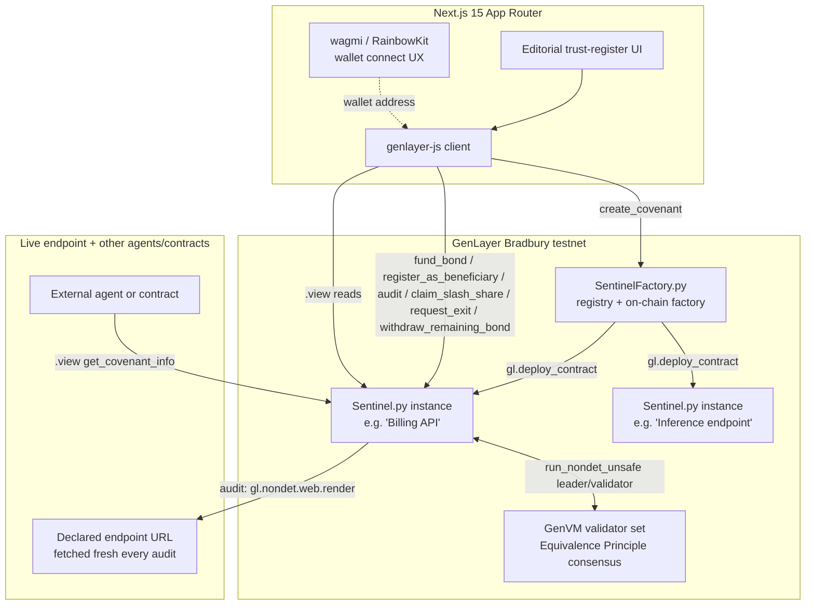

# Architecture

## System overview

## Contract architecture

Two contracts, following the verified `genlayerlabs/intelligent-oracle` factory pattern (same
`py-genlayer` dependency hash independently confirmed live on Bradbury across multiple prior
projects on this stack):

- **`SentinelFactory.py`** — a registry that deploys a fresh `Sentinel` contract per posted
  covenant via `gl.deploy_contract(code=sentinel_source.encode("utf-8"), args=[...], salt_nonce=...)`.
  Sentinel source is passed in as a constructor argument (`sentinel_code: str`) at
  SentinelFactory's own deploy time. Factory metadata (service name, endpoint, spec, seller) is
  stored once at creation and is **read-only** afterward — the factory has no way to be pushed
  live updates from a covenant (see "Why no cross-contract writes" below), so it never claims to
  know a covenant's current bond, streak, or breach history. Callers read that directly from the
  covenant contract. `owner` gates exactly one privileged action — `withdraw_fees()` — and nothing
  else; every other write (`create_covenant`) is intentionally permissionless, gated by the
  creation stake, not an allowlist.
- **`Sentinel.py`** — a single covenant's full lifecycle: `fund_bond` (payable, permissionless,
  auto-activating), `register_as_beneficiary` (permissionless standing registration),
  `audit` (the fail-closed Equivalence Principle consensus step), `claim_slash_share`
  (pull-based breach payout), `request_exit` / `withdraw_remaining_bond` (bounded bond recovery),
  and view methods (`get_covenant_info`, `get_audits`, `get_breaches`, `get_claimable`, …).

## Why a covenant runs continuously, not one-shot

A one-time payment escrow resolves once. A covenant is explicitly designed to keep watching a live
service indefinitely, so `audit()` never terminates the contract's lifecycle — every call is an
independent, permissionless check that either confirms or advances a running streak. There is no
final "resolution"; the covenant simply accumulates an honest, continuously-updated track record
for as long as the seller keeps a bond posted.

## No breach can permanently strand value, and the seller's bond is never locked forever

Every audit either changes nothing, advances a streak, or triggers a breach — and a breach either
slashes into a real, immediately claimable pool or (when nobody yet has standing to receive it)
touches nothing at all. There is no dead end where value sits with no recovery path:

| Situation | How it's reached | What happens |
| --- | --- | --- |
| Compliant audit | Endpoint fetched, judged compliant with confidence ≥ threshold | Consecutive-failure streak resets to zero |
| Unreachable (isolated) | Endpoint fails to fetch, streak/time not yet sustained | Recorded, retriable, no streak movement -- not evidence the seller is actually down |
| Unreachable (sustained) | 3+ consecutive unreachable audits spanning 1h+ | Counts as one confirmed violation, same as a direct violation |
| Violation (below threshold) | Judged non-compliant, confidence < threshold | Recorded as inconclusive -- fail-closed, no streak movement |
| Breach | 3rd consecutive confirmed violation | Bond slashed (clamped to available bond) into a claims pool -- but only if at least one beneficiary is eligible; otherwise the breach is still logged, nothing is moved |
| Bond exit | Seller calls `request_exit()`, waits 72h, calls `withdraw_remaining_bond()` | Whatever wasn't slashed is recovered in full -- audits and slashing stay live for the entire cooldown, so a seller mid-streak cannot dodge an imminent breach by exiting |

This directly closes a real failure mode: a naive design could let a seller escape an about-to-hit
breach by withdrawing the instant a bad streak starts. `request_exit()` only starts a cooldown; it
does not pause `audit()` or block slashing, so the outcome of an in-flight streak is decided before
any bond can leave.

`SentinelFactory`'s creation-stake collection has the same property: every `create_covenant`
payment is tracked in `collected_fees`, and the owner can recover it at any time via
`withdraw_fees()` — it never just accumulates in the contract with no way out.

## Audits are fail-closed

`audit()` never advances the failure streak — and never slashes a unit of real bonded capital —
on a decision that isn't genuinely well-supported:

- If the endpoint fails to fetch, the leader closure detects this **deterministically** (no LLM
  call is even made) and both leader and validators independently agree on an `unreachable`
  outcome. A single unreachable audit does not count as a violation.
- If the model's own reported confidence in a compliant/violation verdict falls below
  `CONFIDENCE_THRESHOLD` (0.6), the audit is recorded as inconclusive — a low-confidence guess
  simply never gets to move the streak in either direction.

Both fail-closed paths leave the covenant exactly where it was — no false accusation, no false
clean bill of health.

## Beneficiary standing is timestamp-snapshotted, never retroactive

`register_as_beneficiary()` is permissionless and free — anyone relying on the service can declare
it at any time. But eligibility for a specific breach's payout is fixed at the moment that breach's
triggering audit is evaluated: only beneficiaries who registered **strictly before** that timestamp
are included in the snapshot stored in `breach_eligible`. Registering after a breach has already
happened grants no claim to it. This closes the obvious "wait for a breach, then register to snipe
the payout" gaming vector without needing a cooldown or a challenge window.

## Storage design

Every persistent field uses only `TreeMap[str, str]` (JSON-encoded values) and `DynArray[str]` —
deliberately, not a style preference. Live testing on prior projects on this stack found that
`TreeMap` value types other than `str` — including `@allow_storage @dataclass` values and plain
scalars like `TreeMap[str, u256]` — deploy successfully (ACCEPTED consensus, looks completely
healthy) but become **permanently unreadable** on the current Bradbury GenVM build. This is a real,
reproduced, dated finding from this same toolchain, not speculation, and it drove every storage
decision in `Sentinel.py` and `SentinelFactory.py`.

## Address normalization

Every address-keyed lookup normalizes the caller-supplied address string to lowercase via
`_normalize_address()` before using it as a key, on both the write and the read side. `Address.as_hex`
is an EIP-55-style checksum (mixed case); comparing it against raw, unnormalized caller input is a
confirmed real GenLayer rejection pattern from a prior submission on this account.

## Why no cross-contract writes

Cross-contract **write** calls (`gl.get_contract_at(addr).emit(...).some_method(...)`) reach
ACCEPTED consensus on the calling contract's own transaction, but the target contract's state never
actually changes — confirmed independently across multiple prior projects on Bradbury. Sentinel
makes **zero** cross-contract calls of any kind: it doesn't read from SentinelFactory, and
SentinelFactory doesn't read from any covenant. This is a deliberate simplification, not an
oversight — a covenant is fully self-contained precisely so any reader (this frontend, another
agent, another contract) can check its status with one direct `.view()` call and no indirection
through the factory.

## Audit consensus

`Sentinel.audit()` uses `gl.vm.run_nondet_unsafe(leader_fn, validator_fn)` with a **hand-coded**
Python validator — not `gl.eq_principle.prompt_comparative`'s natural-language `principle` string.
`validator_fn` calls `leader_fn()` again, independently — re-fetching the live endpoint fresh and
re-running the LLM from scratch — then compares `outcome`/`compliant` (exact match) and `confidence`
(within a 0.15 tolerance, computed in real Python arithmetic). This follows the same pattern
required by a real, confirmed GenLayer rejection reason from a prior submission on this account:
*"the validator checks only verdict shape... it does not independently review the evidence...
redesign the validator to independently acquire and assess the evidence."* See
`RESOLUTION_LOGIC.md` for the full walkthrough.

Both endpoint-fetching and the LLM call happen **inside the single leader closure** passed to
`run_nondet_unsafe` — not as separate top-level nondet calls — because `genvm-lint` (and real
portal reviewers, per documented rejection language) enforce exactly one non-deterministic block
per method.

## Evidence is bound to what was actually fetched, not to what the model claims

`evidence_snapshot` — the on-chain record of "what the audit actually observed" — is sliced
**deterministically from the real fetched response** inside `leader_fn`, never taken from the
LLM's own self-report. A model (hallucinating or adversarial) reporting a fabricated excerpt has
no path to get that into the stored record — the contract only ever stores what it itself fetched.

**What remains an open, acknowledged limitation:** whether a given live response actually satisfies
a natural-language spec is still an LLM's qualitative judgment, not a deterministic check. The
fail-closed confidence gate, the sustained-streak requirement before any slash, and independent
validator re-derivation all materially harden this, but none of them turn "does this response meet
this spec" into a fully mechanical computation. Stated here explicitly rather than implied to be
solved.

## Frontend

Next.js 15 (App Router) + TypeScript strict + Tailwind v4. RainbowKit/wagmi own wallet-connect UX
only (address display, network chrome); all actual contract reads/writes go through `genlayer-js`,
bound to the connected wallet's real injected provider via `connector.getProvider()` (never
`window.ethereum` directly, and never a fresh ephemeral read account per call — both are confirmed
real GenLayer rejection patterns from prior submissions on this account).

Every write flow drives its UI off one shared state machine (`lib/useTransactionLifecycle.ts`):
`submitting → polling → success/error`, polling real transaction status via `pollConsensusStatus`.
Success is determined **strictly**: `lib/genlayer-client.ts`'s `describeTransactionOutcome()`
requires `txExecutionResultName === ExecutionResult.FINISHED_WITH_RETURN` on top of a terminal
consensus status — a transaction that reaches `ACCEPTED` with `txExecutionResultName:
"FINISHED_WITH_ERROR"` (a genuine, confirmed, real behavior on this chain: a contract-level revert
via `gl.vm.UserError` still reaches `ACCEPTED` consensus) is reported as a failure, not a false
success. `txExecutionResultName` being merely absent or `NOT_VOTED` is likewise never defaulted to
success. `create_covenant` requires `FINALIZED` (not just `ACCEPTED`) before its success state is
presented, since its output (a new contract address) is exactly the kind of state other flows act
on and `ACCEPTED` can still be appealed and reversed.

## Known scaling limitations (stated, not hidden)

- **No global index across all covenants' audit history.** The Explorer walks
  `SentinelFactory.get_covenants()` and reads each covenant's cached metadata individually. Fine
  at testnet scale; a real index (subgraph-style, or a denormalized registry field) is the natural
  next step at production scale.
- **Breach eligibility snapshotting is `O(n)` over registered beneficiaries** at breach time —
  bounded by however many addresses have registered, which is expected to stay small relative to
  a covenant's own audit cadence at testnet scale.
- **No excess-value refund on overpayment to `create_covenant`** — any value sent above the
  required creation stake becomes part of `collected_fees` rather than being partially refunded.
  This is a deliberate simplicity tradeoff, disclosed here rather than silently absorbed: the
  amount remains fully recoverable (by the factory owner, via `withdraw_fees`), just not
  automatically returned to the original overpayer.
